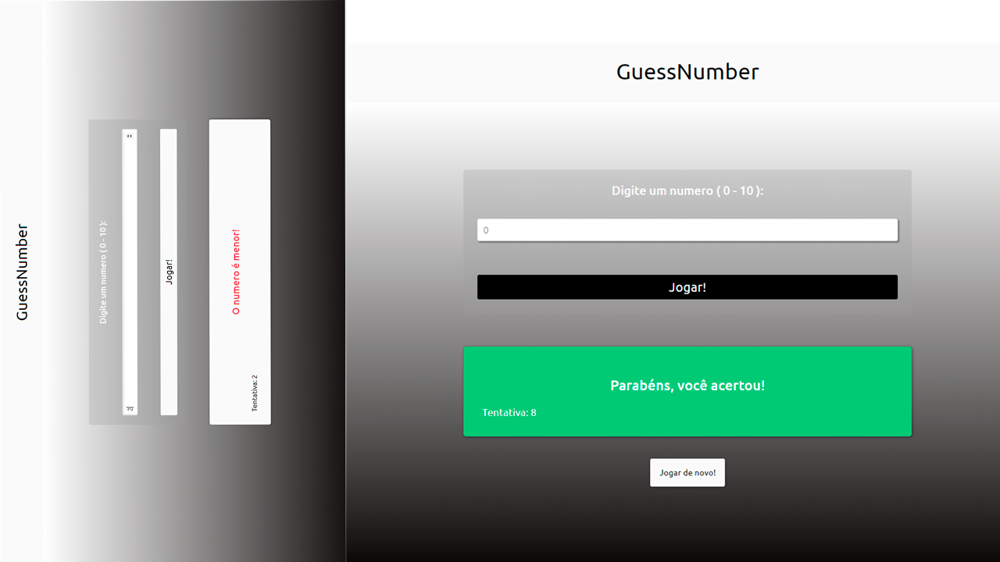

<h1 align="center"> GuessNumber Numero Sorteado </h1>

  

## 🚀 Tecnologias

Esse projeto foi desenvolvido com as seguintes tecnologias:

- HTML e CSS
- JavaScript
- Git e Github

## 💻 Projeto

O GuessNumber é um jogo de pura sorte , onde você tem que acertar o numero que o computador gerou randomicamente.

- [Acesse o projeto finalizado, online](https://ramonwordads.github.io/GuessNumber)
